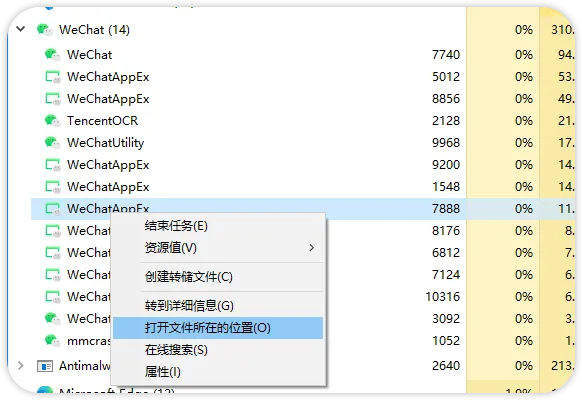
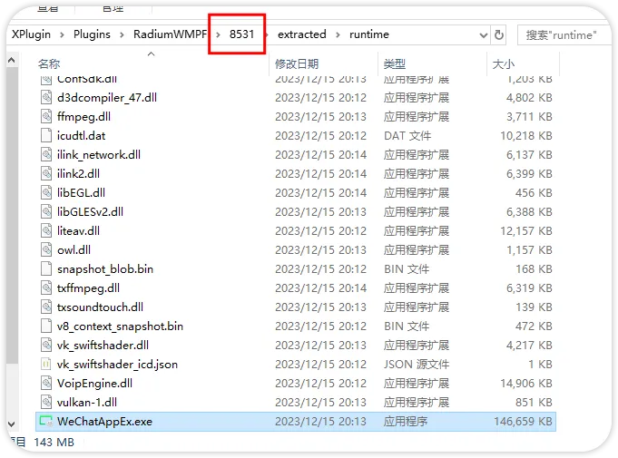
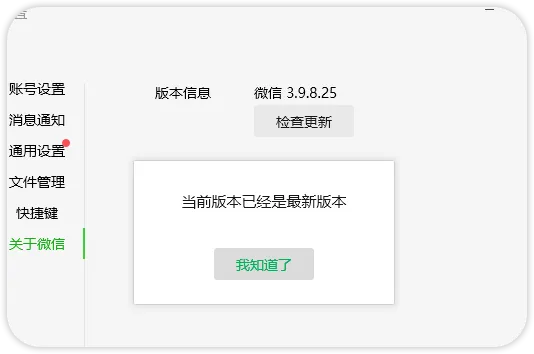
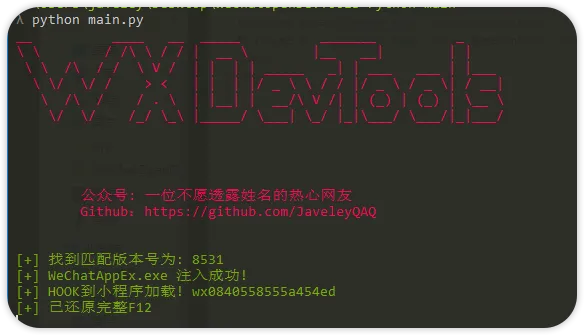
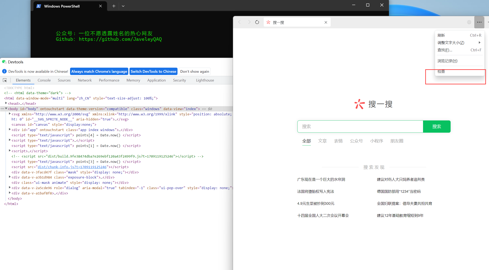

### **注意本库只能作为学习用途, 造成的任何问题与本库开发者无关, 如侵犯到你的权益，请联系删除。**

### **注意本库只能作为学习用途, 造成的任何问题与本库开发者无关, 如侵犯到你的权益，请联系删除。**

### **注意本库只能作为学习用途, 造成的任何问题与本库开发者无关, 如侵犯到你的权益，请联系删除。**

---

# 目录
[1. 支持版本列表](#%E5%A6%82%E4%BD%95%E6%9F%A5%E7%9C%8B%E5%BD%93%E5%89%8D%E8%BF%90%E8%A1%8C%E7%89%88%E6%9C%AC)

[2. 如何查看当前运行版本?](#%E5%A6%82%E4%BD%95%E6%9F%A5%E7%9C%8B%E5%BD%93%E5%89%8D%E8%BF%90%E8%A1%8C%E7%89%88%E6%9C%AC)
  - [windows](#windows)
  - [mac](#mac)
    
[3. 食用方法](#%E9%A3%9F%E7%94%A8%E6%96%B9%E6%B3%95)

 - [开启小程序F12](#%E9%A3%9F%E7%94%A8%E6%96%B9%E6%B3%95)

 - [开启微信内置浏览器F12](#%E5%BC%80%E5%90%AF%E5%BE%AE%E4%BF%A1%E5%86%85%E7%BD%AE%E6%B5%8F%E8%A7%88%E5%99%A8F12)

 - [绕过微信版本检查](#%E7%BB%95%E8%BF%87%E5%BE%AE%E4%BF%A1%E7%89%88%E6%9C%AC%E6%A3%80%E6%9F%A5)

 - [自动启动微信并绕过版本检查](#%E8%87%AA%E5%8A%A8%E5%90%AF%E5%8A%A8%E5%BE%AE%E4%BF%A1%E5%B9%B6%E7%BB%95%E8%BF%87%E7%89%88%E6%9C%AC%E6%A3%80%E6%9F%A5)

[4. 常见问题](#%E5%B8%B8%E8%A7%81%E9%97%AE%E9%A2%98)

[5. 微信4.1.0版本说明](#微信4.1.0版本说明)

[6. 微信4.1.0版本限制说明](#微信4.1.0版本限制说明)


---


## 支持版本列表

> 感谢志远大佬的WeChatOpenDevTool开源 代码只是把node改用python3重写，简单实现了一些自动化问题，重要代码都是原作者的。

| Windows 微信版本 | 小程序版本 | 是否为最新版 |
| ---------------- | ---------- | ------------ |
| 4.1.0            | 13080813   | ✅           |
|                 | 11275_x64   | ✅           |
|                 | 11253_x64   | ✅           |
|                 | 11205_x64   | ✅           |
|                 | 11159_x64   | ✅           |
| 3.9.10.19_x64    | 9129_x64   | ✅           |
| 3.9.10.19_x64    | 9115_x64   | ✅           |
| 3.9.10.19_x64    | 8555_x64   | ❌           |
| 3.9.10.19_x64    | 9105_x64   | ❌           |
| 3.9.9.43_x64     | 8555_x64   | ❌           |
| 3.9.9.43_x64     | 9079_x64   | ❌           |
| 3.9.8.25_x64     | 8531_x64   | ❌           |
| 3.9.8.25_x64     | 8529_x64   | ❌           |
| 3.9.8.25_x64     | 8519_x64   | ❌           |
| 3.9.8.25_x64     | 8501_x64   | ❌           |
| 3.9.8.25_x64     | 8461_x64   | ❌           |
| 3.9.8.25_x64     | 8447_x64   | ❌           |

---


| Mac x64微信版本              | 是否为最新版   | x             
| ----------------            | ------------ | ------------ 
| MacWechat/3.8.8(0x13080811) | ✅           | 源码运行            
| MacWechat/3.8.8(0x13080812) | ✅           | 源码运行   


## 如何查看当前运行版本？
### windows
  





### mac
```bash
ps aux | grep 'WeChatAppEx' |  grep -v 'grep' | grep  "wmpf-mojo-handle" 
```


## 食用方法

### 开启小程序F12

> ~~只支持windows版本微信~~，运行前先启动微信运行前先启动微信（建议小号,别被封了。。。)

1. 安装python3版本
2. 下载WeChatOpenDevTools-Python或直接下载编译好的exe
   [WeChatOpenDevTools_64.exe](https://github.com/JaveleyQAQ/WeChatOpenDevTools-Python/releases/)

安装依赖

```
pip3  install -r requirements.txt
```

运行✅

```
python main.py -x
```




---

### 开启微信内置浏览器F12

```python
python  main.py -c
```




---

### 绕过微信版本检查

对于因微信版本过低而无法登录的情况，可以通过以下方式绕过版本检查：

```python
python new_version_support/main.py -b
```

该工具将通过Hook技术拦截微信的版本检查机制，允许你使用较低版本的微信正常登录。

运行后，工具会自动：
1. 检测正在运行的微信进程
2. 注入绕过脚本
3. 拦截版本检查相关函数调用
4. 允许微信正常登录

注意：使用此功能需要以管理员权限运行。

---

### 自动启动微信并绕过版本检查

对于需要自动启动微信并同时应用版本检查绕过的情况，可以使用以下命令：

```python
python new_version_support/main.py -a
```

该工具将：
1. 自动查找微信安装路径
2. 启动微信客户端
3. 等待微信完全启动
4. 应用版本检查绕过

这是最方便的一键式解决方案，特别适合需要频繁使用低版本微信的场景。

注意：使用此功能需要以管理员权限运行。

---

## 微信4.1.0版本说明

对于微信4.1.0版本，由于微信加强了安全机制，传统的调试方法可能已经失效。虽然本工具可以成功注入微信进程，但可能会遇到内存访问错误：

```
内存访问错误已忽略: Error: access violation accessing 0x7ff70111456f
replaceParams error: Error: access violation accessing 0x7ff700ef255c
Interceptor error for version 13080813: Error: access violation accessing 0x7ff700d23b38
```

这些错误是由于微信4.1.0版本对内部结构进行了调整，导致配置文件中保存的内存地址失效。

### 解决方案

1. **使用微信官方开发者工具**（推荐）：
   - 下载地址：https://developers.weixin.qq.com/miniprogram/dev/devtools/download.html
   - 这是官方支持的调试方式，功能完整且稳定

2. **尝试使用本工具**：
   - 即使有内存访问错误，注入本身是成功的
   - 可以尝试打开微信小程序后按F12键查看是否能打开调试界面
   - 可以尝试右键点击小程序界面查看是否有调试选项

3. **查看详细说明**：
   - 更多信息请参考 [DEBUGGING_410_ISSUES.md](DEBUGGING_410_ISSUES.md) 文件

---

## 微信4.1.0版本限制说明

微信4.1.0版本显著增强了安全机制，传统的非官方调试方法已经失效。详细信息请参考 [WECHAT_410_LIMITATIONS.md](WECHAT_410_LIMITATIONS.md) 文件。

---

## 常见问题

* 无法修改中文
  
  - yes
* 提示找不到版本或微信未运行❌
  
  - 1. 请先看支持的微信版本和小程序版本
       - 如果还有问题看：[微信版本和小程序版本都是符合要求的，但是仍然显示"未找到匹配版本的微信进程或微信未运行"](https://github.com/JaveleyQAQ/WeChatOpenDevTools-Python/issues/38)
    2. **如果微信版本相同小程序版本不同，就删除小程序版本目录并重启微信，直到刷出支持的小程序版本目录**
    3. 最后回到上级目录，设置文件夹权限为只读，这样就能一直保持小程序版本一致
       [image](https://github.com/JaveleyQAQ/WeChatOpenDevTools-Python/assets/132129852/c2b793c3-6d81-424e-a167-3b1e584cef6f)
* 怎么回退版本？
  
  - https://weixin.qq.com/cgi-bin/readtemplate?lang=zh_CN&t=weixin_faq_list&head=true
  - https://github.com/tom-snow/wechat-windows-versions/releases


* mac版本闪退
  -  ~~[macOS版本](https://github.com/JaveleyQAQ/WeChatOpenDevTools-Python/releases/)不能和windows版本一样随时hook小程序修改F12，只能先加载小程序后再hook（必须是有小程序缓存了，不然会闪退）~~
  - 可以先启动多个需要调试的小程序后再运行软件然后再刷新小程序
* mac版本提示 [ Error: Unable to access process with pid xxx from the current user account](https://github.com/JaveleyQAQ/WeChatOpenDevTools-Python/issues/49)
## Star History

[](https://star-history.com/#javeleyqaq/WeChatOpenDevTools-Python&Date)